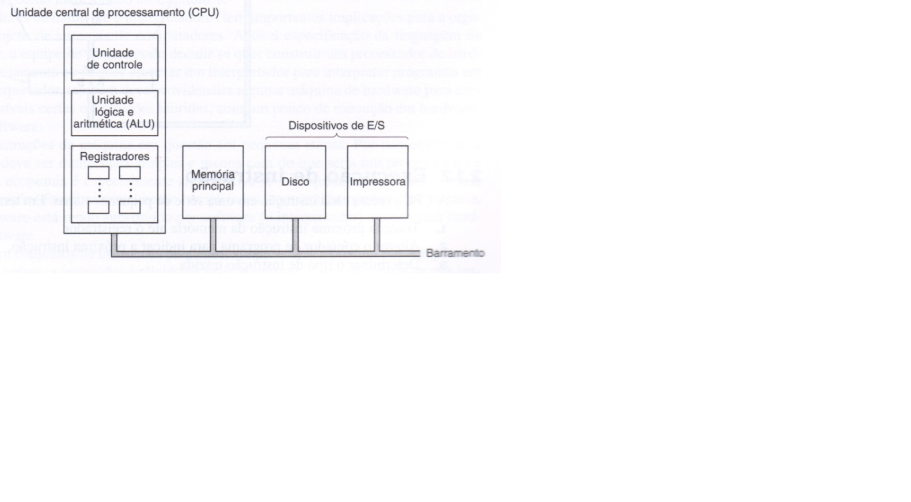

<h1>Anotacoes</h1>

 

(i) declaração de variável e alocação de memória;  
(ii)constantes e operandos imediatos;  
(iii) atribuição de variáveis e sua correspondência com as operações de acesso à memória;  
(iv) operações aritméticas e sua execução no hardware;

 

primeiro computador eletrônico desenvolvido foi o "ENIAC" (mas, se considerarmos a definição do dicionário,
então, chegaremos à conclusão de que o ENIAC não foi o primeiro aparelho desenvolvido para computar)

 

Uma das primeiras ferramentas desenvolvidas para auxiliar o cálculo chama-se Ábaco. A data do desenvolvimento do ábaco é
imprecisa; algumas fontes descrevem que os babilônios o usavam para realizar cálculos por volta de 2.400 a.C.
Na Idade Média os romanos também o usavam, no entanto o aperfeiçoamento dessa ferramenta foi feita pelos japoneses e chineses.

 

O ábaco não supria todas as necessidades dos intelectuais do século
XVII, portanto novas iniciativas para o desenvolvimento de novas ferramentas foram feitas.
Foi nesse século que o inglês Willian Oughtred inventou a régua de cálculo, que consistia em
uma régua que apresentava resultados pré-definidos de multiplicações.

 

John Von Neumann, ainda na Segunda Guerra Mundial, dedicou-se ao
desenvolvimento do computador, tomando como base a teoria de Turing. Ele conseguiu
resolver um dos principais problemas técnicos da época, relacionado ao armazenamento de
dados em memórias magnéticas. Esse importante passo possibilitou que os programas
pudessem ser armazenados diretamente em componentes eletrônicos e não mais em fitas
perfuradas. Esse e outros fatos ocorridos na história da evolução dos computadores
permitiram que, hoje, possamos ter um computador para ser usado em casa, em empresas,
nas universidades e em qualquer outro local onde se faça necessário.
A contribuição de Neumann para a computação foi fundamental; ele fez parte da
equipe que desenvolveu o ENIAC, considerado o primeiro computador eletrônico. Até pelas
condições tecnológicas da época, o ENIAC ocupou um grande espaço físico e científico: para
se ter ideia do espaço físico, o conjunto todo ocupava três andares de um prédio.

 

Chamo a sua atenção para o fato de que um computador digital é uma máquina que
pode resolver problemas executando um conjunto limitado de instruções e essas instruções
estão estritamente relacionadas ao microprocessador de um determinado fabricante, um
programa escrito em linguagem de alto nível, como Java, C++, VB.NET, C# e outras, que,
quando executadas, passam por algumas conversões até virarem instruções que o
microprocessador possa entender.Os microprocessadores só entendem os bits “1” e “0”,
portanto qualquer programa é convertido a uma dessas instruções, constituídas de “1” e “0”,
limitadas do microprocessador. Esse procedimento é usado por ser mais confiável para
codificar informações digitais e por propiciar maiores velocidades de processamento.

 

 

A unidade central de processamento é considerada o cérebro do computador. Sua
função é executar programas que foram armazenados na memória principal, à qual damos o
nome de memória RAM. Nesse dispositivo ficam os programas e os aplicativos que estão
sendo executados no momento, portanto o sistema operacional tem a função de controlar
essa arquitetura, buscando as instruções, examinando-as e disponibilizando para execução
uma após a outra.

 

Os componentes eletrônicos e mecânicos são conectados por um conjunto de fios
paralelos ao qual damos o nome de barramento. Eles têm a função de servir de via para a
transmissão de endereços, dados e sinais de controles. Os barramentos podem ser externos à
CPU; neste caso ele serve para conectar a memória e os dispositivos de entrada e saída, mas
também podem ser internos à CPU, ou seja, dentro do chip da CPU há barramentos que são
usados para o tráfego de instruções ou dados capturados da memória.

 

 Analisando a figura , podemos notar que a CPU é composta por algumas outras
partes. Uma delas é a unidade de controle, que é responsável por endereçar, ou seja, apontar
para uma posição da memória onde estará o dado ou instrução a ser carregada para o
processador e controlar se esses dados serão lidos ou escritos na memória principal.
Analogamente podemos considerar que a memória é parecida com um vetor; cada linha é
composta por oito bits e tem um número ao qual damos o nome de endereço. A CPU tem
que, de alguma maneira, capturar as informações contidas na memória para serem
processados. Essas informações são capturadas pela indicação do endereço de onde eles estão
armazenados. 

 

Conforme pode ser verificado na figura 5, a unidade lógica e aritmética recebe duas
informações, uma de cada registrador. Esses dados serão processados pela unidade lógica e
aritmética, que retornará um resultado e irá inseri-lo em um dos registradores. Portanto você
pode perceber que os dados vêm dos registradores, passam pela unidade lógica e aritmética e
um resultado é obtido e enviado para um dos registradores. Basicamente é assim que
funciona a unidade lógica e aritmética: os dados são enviados da memória principal para os
registradores e o resultado da operação pode ser inserido em um dos registradores ou, então,
voltar direto para a memória principal.

 

Os microprocessadores atuais contêm uma pequena memória de alta velocidade usada
para armazenar resultados temporários e controlar informações. Essa memória, chamada
registrador, é composta de uma pequena quantidade de espaço. Normalmente, todos os
registradores têm o mesmo tamanho. Cada registrador tem uma função específica e eles
podem ser lidos e escritos em altas velocidades, pois são internos à CPU e usam o seu
barramento interno.

 

Todas as máquinas construídas até o início do projeto do ENIAC eram programadas e
controladas através de meios externos, como cartões perfurados, fitas perfuradas, painéis de
interruptores, cabos de conexões etc.; dispunham de pouquíssima memória para armazenar os
dados e os resultados intermediários dos cálculos. A construção do ENIAC, cuja capacidade
de armazenamento era de vinte números, consumiu mais de 17.000 válvulas eletrônicas. Um
fator decisivo para viabilizar o projeto de uma nova máquina foi a ideia de utilizar técnicas
para implementar memória de custo mais baixo para substituir as válvulas. Com essa ideia,
tornou-se possível pensar numa máquina com dezenas ou centenas de milhares de bits. John
Von Neumann foi um dos responsáveis pelo desenvolvimento das pesquisas em memórias,
pois sua ideia era fazer com que os programas fossem armazenados diretamente nos
computadores e que os meios descritos acima para armazená-los deixassem de ser utilizados.
Com sua contribuição, os computadores e os programas tornaram-se mais rápidos, mais
flexíveis e mais eficientes.

 

<h2>Computadores de uso geral e computadores de uso específico</h2>

Algumas vezes você poderá se deparar com as terminologias “computador de uso
geral” e “computador de uso específico”. Vamos conceituar cada uma delas e dar alguns
exemplos para elucidar essas definições.

 

Um computador de uso geral é aquele desenvolvido para executar uma variedade de
atividades; o projeto desses computadores é feito para que eles possam lidar com diversas
situações e circunstâncias. Como exemplo, podemos citar todos os computadores que são
anunciados para venda, geralmente, usando um sistema operacional Windows, Linux ou
MAC. Esses computadores são adquiridos para serem usados em uma variedade grande de
situações, como acesso à internet, leitura e-mails, telefonemas, desenvolvimento de textos,
planilhas, banco de dados, desenhos, execução de jogos, filmes, programas e aplicativos em
praticamente todos os ramos profissionais. Além disso, esses computadores permitem a
personalização de interfaces e áreas de trabalho conforme a preferência de cada um. É
importante que fique claro que esses computadores têm uma arquitetura que permite que isso
seja possível desde que sejam instalados os softwares aplicativos para executar as atividades
em questão. 

 

Os computadores de uso específico já são projetados para executar uma quantidade
limitada de tarefas. A arquitetura desses computadores é projetada para potencializar o
desempenho em detrimento da variedade de atividades e quantidade de programas a serem
executados. Geralmente estes computadores são apresentados com formas apropriadas à
atividade para a qual ele foi desenvolvido. São exemplos de computadores de uso específico
os medidores de tráfego em redes de computadores, roteadores também usados em redes de
computadores, televisão, aparelho celular (smartphones), computadores usados em
computação gráfica para desenvolvimento de filmes e desenhos. Esses computadores,
conforme já foi descrito, usam componentes específicos para determinadas funções; os
processadores, as interfaces gráficas e os sistemas operacionais são desenvolvidos para
proporcionar o melhor desempenho do conjunto. Em linhas gerais, não há como executar
outras atividades a não ser aquela para a qual ele foi projetado, portanto, esses computadores
costumam ser mais caros. 

<h3> Medidads de desempenho</h3>

O tempo de execução é, geralmente, a unidade de medida usada para determinar o
desempenho de um computador. Nesse sentido, devem ser consideradas algumas variáveis,
como: a quantidade de processos que estão sendo executados, a quantidade de memória
disponível, a velocidade do clock, a quantidade de instruções executadas por ciclo, dentre
outras. Resumindo, a medida de desempenho de um computador depende da velocidade de
cada um de seus diferentes principais componentes. 

Muitas vezes a velocidade do clock e a quantidade de núcleos nos processadores são
anunciadas como referência ao desempenho dos computadores, no entanto outros fatores
devem ser analisados, embora muitos deles acabem sendo compatíveis entre si. Esses fatores
incluem o acesso aos dispositivos de entrada e saída, o software básico e a hierarquia de
memória. 

Uma das partes mais prejudiciais ao desempenho refere-se aos dispositivos de E/S,
principalmente aqueles que envolvem partes mecânicas para acesso à informação, como é o
caso dos HDs e dispositivos de escrita e leitura ótica. O acesso a esses dispositivos ocorre com
menos evolução em relação aos processadores, aspecto que influencia o desempenho do
conjunto na execução de tarefas.  

 Vamos analisar o impacto do sistema de E/S no desempenho descrito por Guntzel:
Suponha que temos um benchmark que executa em 100 segundos divididos em: 90s
de processador + 10s de E/S. Se o tempo de processador melhorar em 50% ao ano para os
próximos anos, mas o tempo de E/S se mantiver, quanto esse programa vai ficar mais rápido
ao final de 5 anos?
 
Obs. Benchmark são programas específicos para medir o desempenho.
Solução:
Tempo decorrido = tempo de processador + tempo de E/S
100 = 90 + Tempo de E/S
Após n anos Tempo de
Processador
Tempo de E/S / Tempo decorrido / % Tempo decorrido gasto em E/S

0 90s 10s 100s 10%
1 90/1.5=60s 10s 70s 14%
2 60/1.5=40s 10s 50s 20%
3 40/1.5=27s 10s 37s 27%
4 27/1.5=18s 10s 28s 36%
5 18/1.5=12s 10s 22s 45%
 
Analisando a tabela acima, podemos notar que o tempo de execução do processador,
considerando uma melhora de cinquenta por cento ao ano, executa a atividade em 90
segundos no primeiro ano e chega a executar a mesma atividade em 12 segundos após cinco
anos. No entanto, se o tempo do dispositivo de E/S continuar o mesmo, ou seja, conforme o
exemplo, dez segundos, podemos perceber que, após cinco anos, a porcentagem do E/S
chega a quase cinquenta por cento na execução da atividade, ou seja, enquanto o
processador executa a atividade em doze segundos, o dispositivo de E/S continua levando dez
segundos para executá-la. 

<h3> Representacao da informacao<h3>

 Como já citado, os computadores usam uma forma diferente para tratar as informações
que devem ser processadas: enquanto nós, seres humanos, tratamos a informação através de
um conjunto de caracteres alfanuméricos, os computadores consideram apenas bits “1” e “0”,
ou seja, se há ou não um nível de voltagem, geralmente dada por +5v ou 0v, onde +5v
indica o valor binário “1” e o 0v indica o valor “0” em binário. Esta técnica de trabalho
garante às máquinas maior desempenho e facilidade na representação de cada informação.
Nós, seres humanos, trabalhamos com um sistema de numeração na base 10, ou seja,
com os números de 0 a 9 conseguimos representar qualquer número e com o alfabeto
conseguimos escrever sobre tudo. Os computadores trabalham com o sistema de numeração
binária, pois só há dois símbolos, “0” e “1”. Com esse sistema de numeração, ele consegue
representar qualquer número e também representar todas as letras do alfabeto.
Trabalhar com o sistema binário é quase impossível para nós seres humanos, no
entanto deve haver uma forma de tradução do que entendemos para que uma máquina possa
entender. Os primeiros computadores eram manipulados usando algum tipo de material que
pudesse representar 1 e 0; o cartão perfurado e as chaves on/off tinham essa finalidade. Essa
época foi marcada por baixa produtividade e complexidade no desenvolvimento de
programas para executarem determinadas tarefas. Com o passar do tempo, foram surgindo
alguns programas para controlar essas máquinas, aos quais foi dado o nome de sistemas
operacionais. Com eles foi possível tirar a responsabilidade do especialista sobre o controle
total da máquina. Sendo assim, o foco maior, por parte dos especialistas, voltou-se para o
desenvolvimento de programas para realizar determinadas tarefas. Mesmo assim, lidar apenas
com 1 e 0 para desenvolver um programa ainda tornava a atividade complexa e sacrificante,
principalmente se algum erro fosse cometido durante o desenvolvimento. Muitas vezes, era
melhor refazer o código em vez de procurar onde estava o erro.
Surgiram algumas linguagens de programação, às quais chamamos de linguagem de
alto nível. Essas linguagens têm como finalidade tornar a programação mais atraente. Elas
representam uma linguagem mais próxima daquela que um programador possa entender; são
utilizadas palavras mais próximas de nossa linguagem. Dessa forma o programador foca mais
na lógica da programação e não das particularidades da estrutura da linguagem de máquina.
De qualquer forma, após escrever um programa em linguagem de alto nível, ela deverá
ser convertida para a linguagem de máquina, ou seja, em “0” e “1”. Essa interpretação ou
compilação gera um custo relacionado ao desempenho na execução do programa, por esse
motivo aquelas aplicações que necessitam de velocidade na execução - como jogos, sistemas
operacionais, programas que têm a tarefa de renderização de imagens e outros - são
desenvolvidas usando linguagens de mais baixo nível como Assembler, C, C++. 

